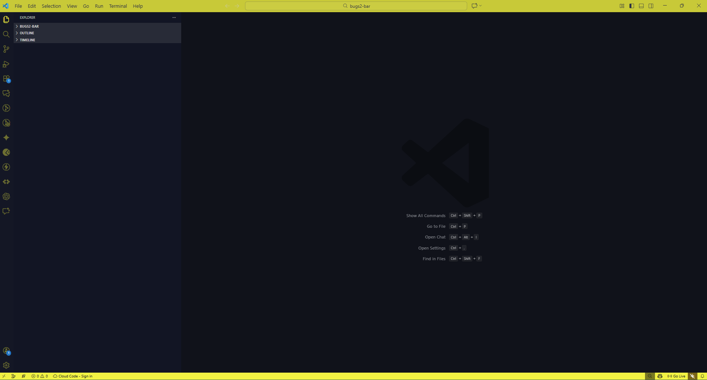
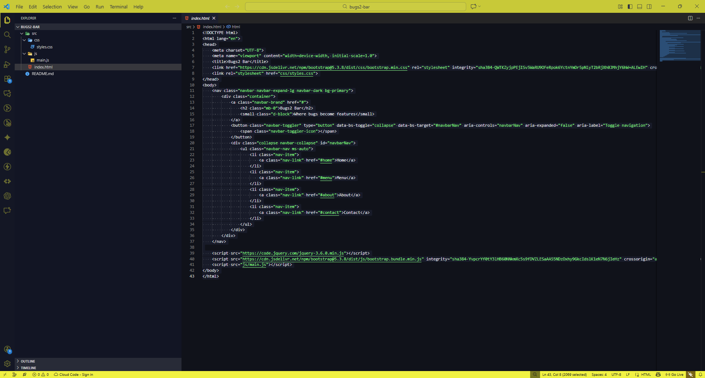

# Nagabhushan Adiga's Theme

Clean, high-contrast chrome with a calm workspace. The theme locks the window chrome to **F5F102** while the editor itself stays deep navy with pastel syntax so your focus stays on the code.

## Highlights

- Matching header + footer + file icons in `#F5F102`
- Dark editor background (`#10121A`) with balanced selection/line highlight colours
- Simple palette tuned for React/JS, markdown, and general scripting

## License

MIT
